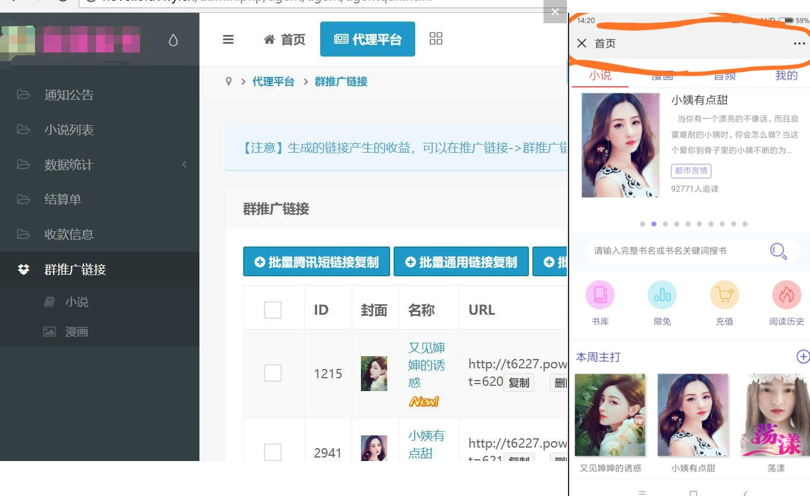
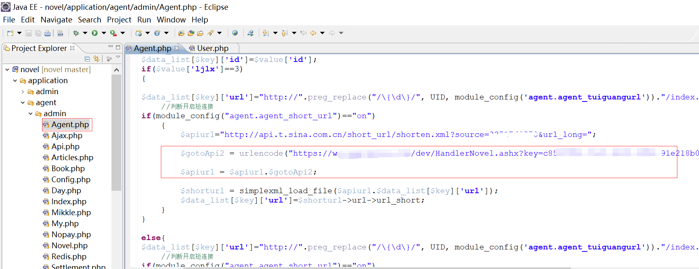
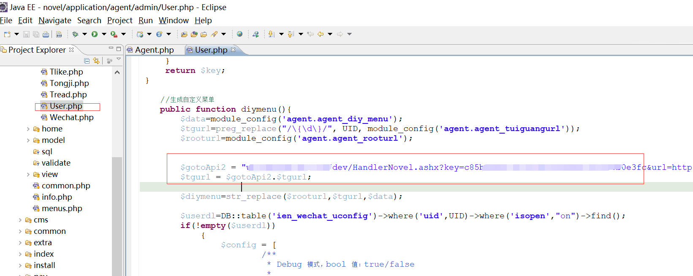
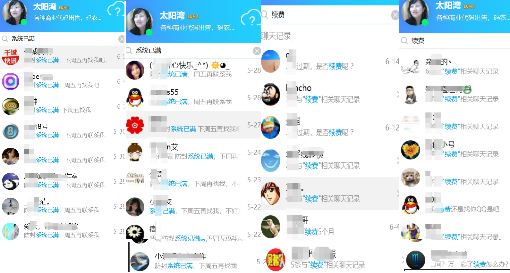

# 某小说平台防封改造

[](LICENSE)
[](https://github.com/gemgin/WeChatTools/pulls)
[](https://github.com/gemgin/WeChatTools)
[](https://github.com/gemgin/WeChatTools)

交流QQ群：41977413,这次是针对某小说平台防封改造，先说说此平台特点.

## 小说平台特点

- 代理商推广需要对接认证的服务公众号

- 每个代理商会自动生成一个二级域名,唯一标识符和uid关联

- 平台主域名和落地域名可以分离，平台的公众号和代理商公众号采用的域名可以不一样

- 有独立的支付接口



## 小说改造技术

> 针对小说特点,决定采用`微信域名防封系统 - 链接自动跳转`模块，用户需要自备多个落地域名,以及购买防封系统豪华版,

- 改造涉及代理商后台两个源代码文件，改造后的代码详细见`novel/application/agent/admin/Agent.php`和`novel/application/agent/admin/User.php`

```
$gotoApi2 = urlencode("https://wx.rrbay.com/dev/HandlerNovel.ashx?key=c85b53b6-7ac2-4e02-b3b4-1234567890fc&amp;url=");
$apiurl = $apiurl.$gotoApi2;

```

```
  
$gotoApi2 = "wx.rrbay.com/dev/HandlerNovel.ashx?key=c85b53b6-7ac2-4e02-b3b4-1234567890fc&amp;url=";
$tgurl = $gotoApi2.$tgurl;

```


## 套餐方案

微信域名新防封系统价格表：http://wx.rrbay.com/price2.html

## 防封系统开放注册

> 名额有限，需要的速度： http://wx2.rrbay.xyz/SharedAccount/LoginOn

> 注册邀请码： 关注`【太阳湾软件】`公众号，回复 `openid`获取

 
